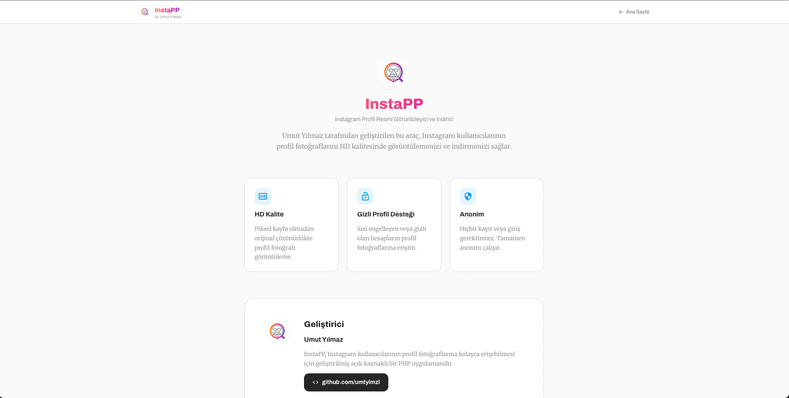

# InstaPP – Instagram Profile Picture Viewer

InstaPP is an open-source PHP application designed to view and download Instagram profile pictures in HD quality.

## Quick Highlights
- View and download profile pictures in HD
- Fetch post, follower, and following counts
- Multi-layer data fetching (Apify + Instagram endpoint + fallback parsing)
- Modern, responsive UI built with Tailwind CSS
- API-ready architecture for mobile and third-party integrations

## Why InstaPP?
InstaPP combines a clean user experience with a robust fallback strategy to deliver Instagram profile data quickly and reliably across devices.

## Author
Umut Yılmaz  
GitHub: https://github.com/umtylmzl

## Screenshots

